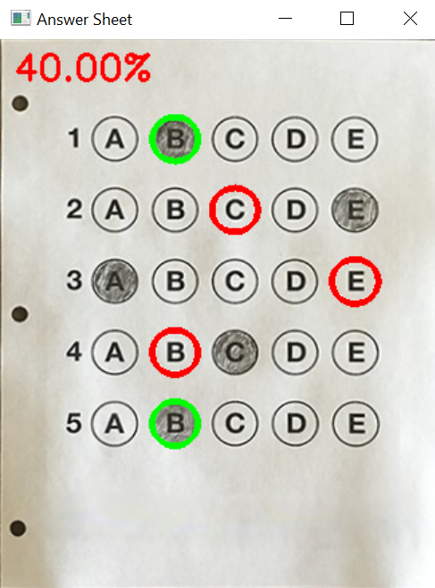
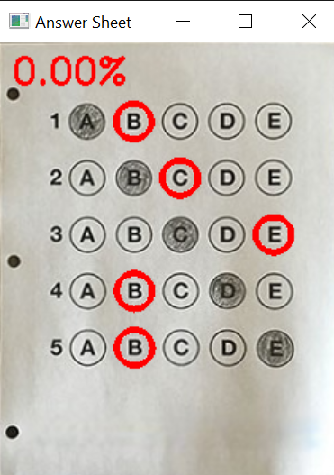
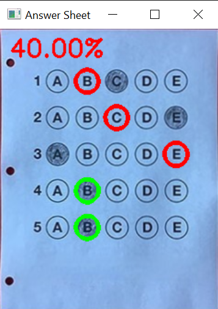

* A simple bubble sheet scanner and test grader using computer vision and image processing techniques.
* Implemented Optical Mark Recognition (OMR) methods which facilitate capturing of human-marked 
documents and automatic analysis of the results.
* Uses Python and OpenCV.

## Output Screenshots:

<table>
  <tr>
    <td>Result Paper 1</td>
     <td>Result Paper 2</td>
     <td>Result Paper 3</td>
  </tr>
  <tr>
    <td></td>
    <td></td>
    <td></td>
  </tr>
 </table>
 All test sheets are available in the img folder.
 
